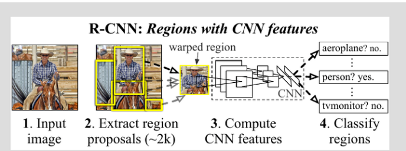
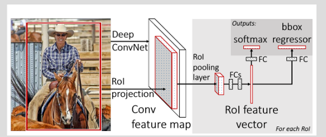
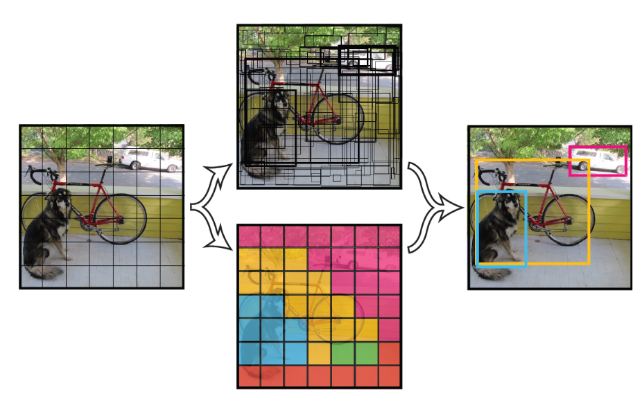
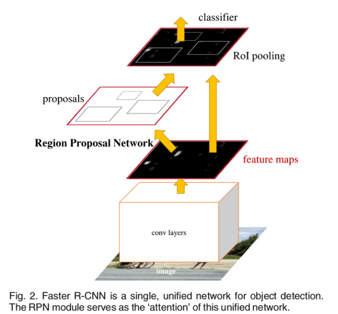
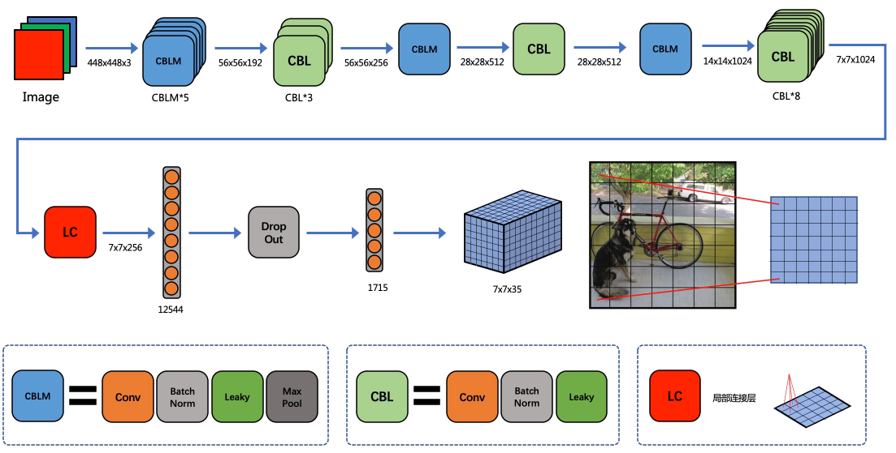
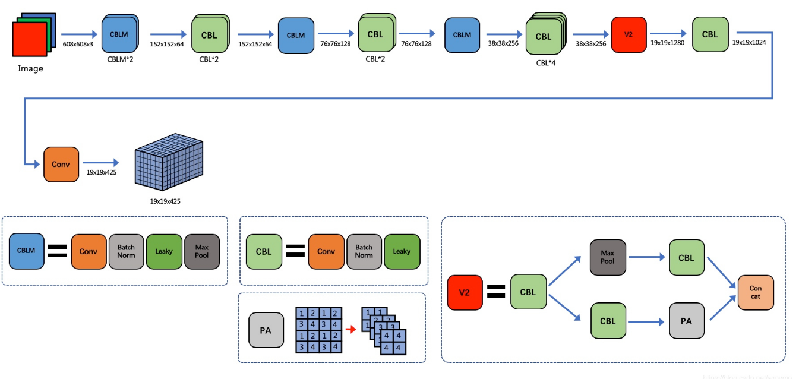
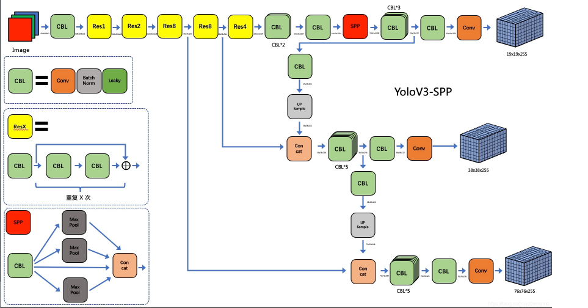
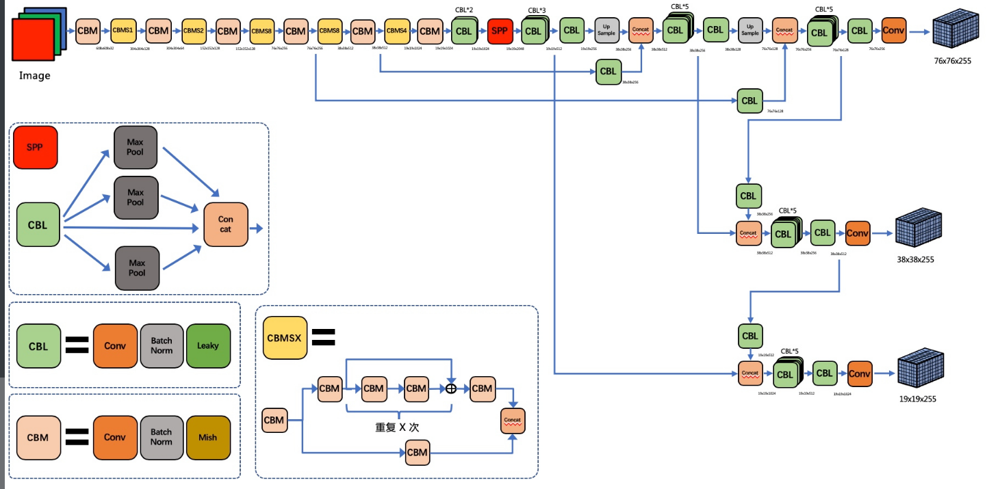

- 网络结构
- 损失函数
- 训练过程
- 测试过程

# RCNN

1）：利用selective-search方法提取2000个自下而上的region proposal；

2）：针对每一个region proposal我们用一个大的CNN网络计算特征；

3）：利用线性SVMs分类器对每个region proposal进行分类；

4）：进行回归分析调整region proposal区域。

# Fast-RCNN

1）读取整个图片和一个ROI（Regions of Interest，也就是一系列划分的bounding box）集合作为输入)；

2）然后convnet从整个图片中提取特征，得到feature map；

3）对每一个ROI区域，pooling层从feature map中提取一个固定大小的feature factor；

4）feature factor被送往FC（fully-connected layer），被映射到两个部分，一部分是评估k个目标类加上catch-all"背景"类的softmax probability；另一部分产生bbox regressor，即针对k个目标对象的每一个4值真值数量（4 real-valued numbers），每个4值编码集合（set of 4 values）K类目标对象之一的bounding-box位置。

# YOLO v1

1）将一幅图像分成SxS个网格(grid cell)，如果某个object的中心 落在这个网格中，则这个网格就负责预测这个object

2）每个网格要预测B个bounding box，每个bounding box除了要回归自身的位置之外，还要附带预测一个confidence值

3）每个bounding box要预测(x, y, w, h)和confidence共5个值，每个网格还要预测一个类别信息，记为C类。则SxS个网格，每个网格要预测B个bounding box还要预测C个categories

## yolov1的缺点：

1）输出层为全连接层，因此在检测时，YOLO训练模型只支持与训练图像相同的输入分辨率。虽然每个格子可以预测B个bounding box，但是最终只选择只选择IOU最高的bounding box作为物体检测输出，即每个格子最多只预测出一个物体。当物体占画面比例较小，如图像中包含畜群或鸟群时，每个格子包含多个物体，但却只能检测出其中一个。这是YOLO方法的一个缺陷。

2）YOLO采用了多个下采样层，网络学到的物体特征并不精细，因此也会影响检测效果。)YOLO loss函数中，大物体IOU误差和小物体IOU误差对网络训练中loss贡献值接近（虽然采用求平方根方式，但没有根本解决问题）。因此，对于小物体，小的IOU误差也会对网络优化过程造成很大的影响，从而降低了物体检测的定位准确性。

YOLO对相互靠的很近的物体，还有很小的群体 检测效果不好，这是因为一个网格中只预测了两个框，并且只属于一类。

同一类物体出现的新的不常见的长宽比和其他情况时，泛化能力偏弱。

由于损失函数的问题，定位误差是影响检测效果的主要原因。尤其是大小物体的处理上，还有待加强

# Faster-RCNN

1）：针对整张图片，利用CNN获取feature map；

2）：利用RPN网络针对feature map进行全连接运算，将其输出为256d或者512d的低维特征向量，

3）：最后将该低维向量送入两个全连接层，即box回归层和box分类层。

# YOLOV1

1)yolo 是 one stage 算法的开篇之作，它并没有真正的去掉候选区，而是划分了“负责”区域（7\(\times\)7 个网格）。在每个“负责”区域会预测两个 bbox ，所以一共会预测 98 个 bbox。RCNN 系列是先通过算法找到候选区，然后对候选区进行**边框回归**，得到最终的 bbox。yolov1 则是直接对负责区域直接进行判别和回归，一步到位的 bbox。

# YOLOV2

YoloV2 的最大不同在于引入了 \(V2\) 这个模块（这个名字是我自己起的）这个模块的目的期望减少 feature map 空间维度的同时尽量不损失信息。而且它具有了 split transform merge 的形式，一定程度上开始有了特征融合的感觉。最后是网络的输出 tensor

# YOLOV3

YoloV3 的网络框架有了很大的改变，它在“特征融合”上做了很大的改进。YoloV3 也有两个版本，一个是普通版，一个是YoloV3-spp。YoloV3-spp 版本很重要，因为它直接启发了后续的 YoloV4。

YoloV3 采用和 YoloV2 同样的 gd 编码方式。并也采用了 anchor 的思想。它借鉴了特征图金字塔的思想，用不同尺度的特征图来检测目标。小尺寸特征图感受野大，于是用来检测大尺寸的物体，大尺寸的特征图感受野小，检测小尺寸的物体。（其实也算是借鉴了 SSD 的思想）

## 改进之处

- 多尺度预测 （引入FPN）。
- 更好的基础分类网络（darknet-53, 类似于ResNet引入残差结构）。
- 分类器不在使用Softmax，分类损失采用binary cross-entropy loss（二分类交叉损失熵）

# YOLOV4

YOLOv4框架：

- Backbone：CSPDarknet53
- Neck：SPP，PAN
- Head：YOLOv3

YOLOv4 = CSPDarknet53+SPP+PAN+YOLOv3

其中YOLOv4用到相当多的技巧：

- 用于backbone的BoF：CutMix和Mosaic数据增强，DropBlock正则化，Class label smoothing
- 用于backbone的BoS：Mish激活函数，CSP，MiWRC
- 用于检测器的BoF：CIoU-loss，CmBN，DropBlock正则化，Mosaic数据增强，Self-Adversarial 训练，消除网格敏感性，对单个ground-truth使用多个anchor，Cosine annealing scheduler，最佳超参数，Random training shapes
- 用于检测器的Bos：Mish激活函数，SPP，SAM，PAN，DIoU-NMS

# YOLOV5

YOLO V5在进行学习自动锚定框的尺寸

**Backbone-跨阶段局部网络(CSP)**

YOLO V5和V4都使用CSPDarknet作为Backbone，从输入图像中提取丰富的信息特征。CSPNet全称是[Cross Stage Partial Networks](https://link.zhihu.com/?target=https%3A//arxiv.org/pdf/1911.11929.pdf)，也就是跨阶段局部网络。CSPNet解决了其他大型卷积神经网络框架Backbone中网络优化的梯度信息重复问题，将梯度的变化从头到尾地集成到特征图中，因此减少了模型的参数量和FLOPS数值，既保证了推理速度和准确率，又减小了模型尺寸。

CSPNet实际上是基于Densnet的思想，复制基础层的特征映射图，通过dense block 发送副本到下一个阶段，从而将基础层的特征映射图分离出来。这样可以有效缓解梯度消失问题(通过非常深的网络很难去反推丢失信号) ，支持特征传播，鼓励网络重用特征，从而减少网络参数数量。

## **Neck-路径聚合网络(PANET)**

Neck主要用于生成特征金字塔。特征金字塔会增强模型对于不同缩放尺度对象的检测，从而能够识别不同大小和尺度的同一个物体。在PANET出来之前，FPN一直是对象检测框架特征聚合层的State of the art，直到PANET的出现。在YOLO V4的研究中，PANET被认为是最适合YOLO的特征融合网络，因此YOLO V5和V4都使用PANET作为Neck来聚合特征。

PANET基于 Mask R-CNN 和 FPN 框架，同时加强了信息传播。该网络的特征提取器采用了一种新的增强自下向上路径的 FPN 结构，改善了低层特征的传播。第三条通路的每个阶段都将前一阶段的特征映射作为输入，并用3x3卷积层处理它们。输出通过横向连接被添加到自上而下通路的同一阶段特征图中，这些特征图为下一阶段提供信息。同时使用自适应特征池化(Adaptive feature pooling)恢复每个候选区域和所有特征层次之间被破坏的信息路径，聚合每个特征层次上的每个候选区域，避免被任意分配。

## **Head-YOLO 通用检测层**

模型Head主要用于最终检测部分。它在特征图上应用锚定框，并生成带有类概率、对象得分和包围框的最终输出向量。

在 YOLO V5模型中，模型Head与之前的 YOLO V3和 V4版本相同。

## 激活函數

在 YOLO V5中，中间/隐藏层使用了 Leaky ReLU 激活函数，最后的检测层使用了 Sigmoid 形激活函数。而YOLO V4使用Mish激活函数。

## **Optimization Function**

YOLO V5的作者为我们提供了两个优化函数Adam和SGD，并都预设了与之匹配的训练超参数。默认为SGD。

YOLO V4使用SGD。

YOLO V5的作者建议是，如果需要训练较小的自定义数据集，Adam是更合适的选择，尽管Adam的学习率通常比SGD低。但是如果训练大型数据集，对于YOLOV5来说SGD效果比Adam好。

实际上学术界上对于SGD和Adam哪个更好，一直没有统一的定论，取决于实际项目情况。

## **Cost Function** 

YOLO 系列的损失计算是基于 objectness score, class probability score,和 bounding box regression score.

YOLO V5使用 GIOU Loss作为bounding box的损失。

YOLO V5使用二进制交叉熵和 Logits 损失函数计算类概率和目标得分的损失。同时我们也可以使用fl _ gamma参数来激活Focal loss计算损失函数。

YOLO V4使用 CIOU Loss作为bounding box的损失，与其他提到的方法相比，CIOU带来了更快的收敛和更好的性能。

# RCNN和Yolo主要区别

RPN介绍：Region Proposal Network，利用卷积后的特征图生成region proposal，通过增加两个卷基层实现，RPN网络输出的是坐标和score两类。

以上的三种方法都是将目标检测分为两部分实现的：

1）物体的类别；分类问题。

2）物体的区域，即bounding box，回归问题。

而YOLO将问题直接当做回归问题求解，输入图像经过处理，可以直接获取到图像中物体的类别及其confidence以及物体的位置。